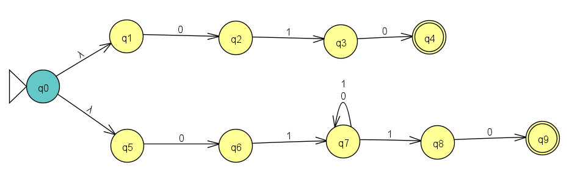
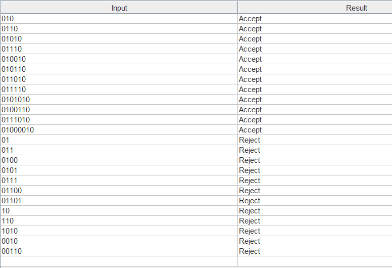

# Exercise n08: Report

**Language:** {string s | s starts with 01 and ends with 10}, alphabet {0, 1}

## 1. NFA diagram

The start state q0 has two λ-transitions:
- **Top branch (q1, q2):** toggles on `0` to track the parity of zeros, with a loop on `1` in each state. q2 is Final (odd number of 0's).
- **Bottom branch (q3, q4, q5):** counts the 1's modulo 3, with a loop on `0` in each state. q4 is Final (3k+1 ones).

A string is accepted if either branch ends in its Final state.

## 2. Batch run of the test strings

File: [n08t.txt](n08t.txt). Lines 1-11 are accepted and lines 12-22 are rejected.

All 22 strings gave the expected result.
