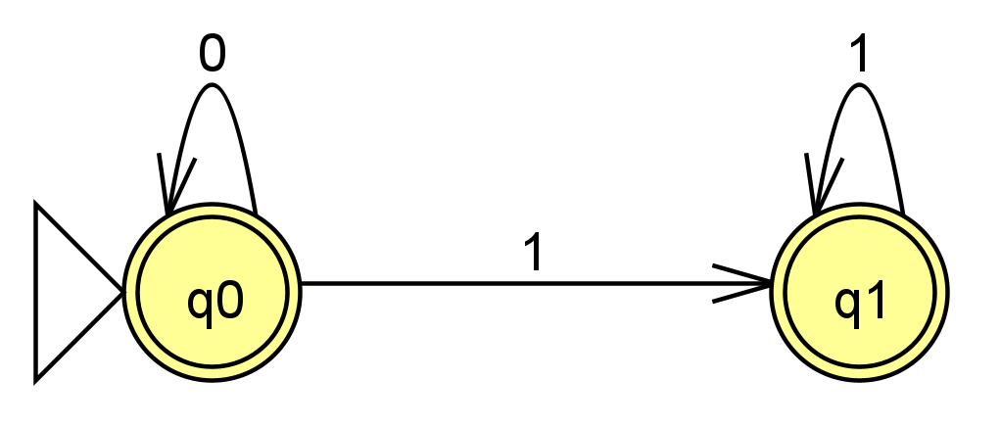
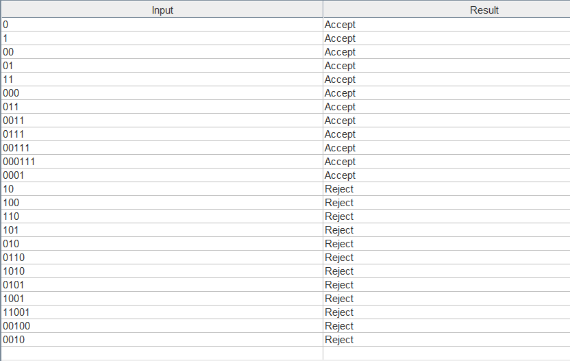
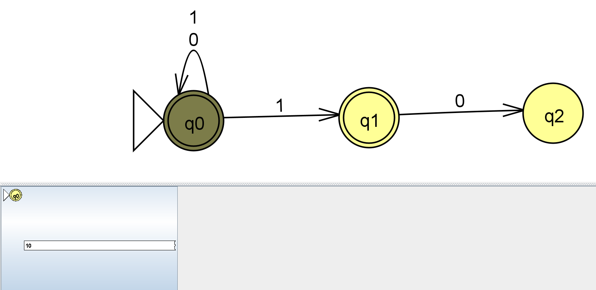
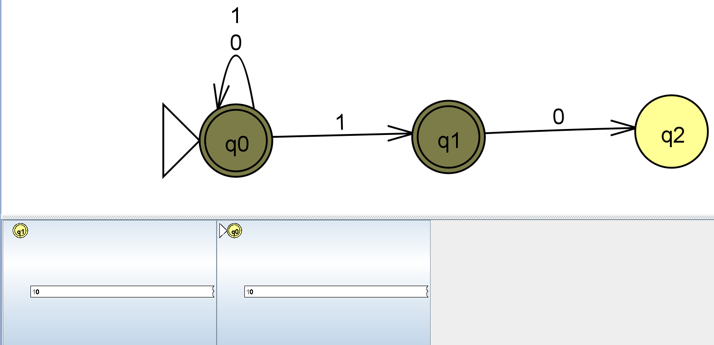
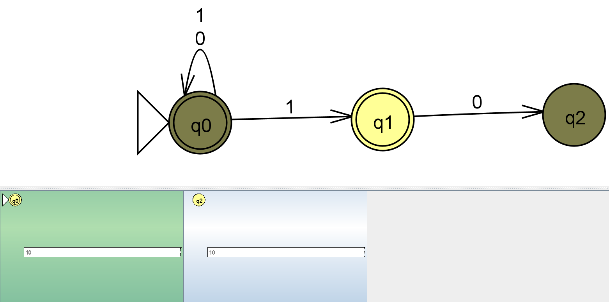
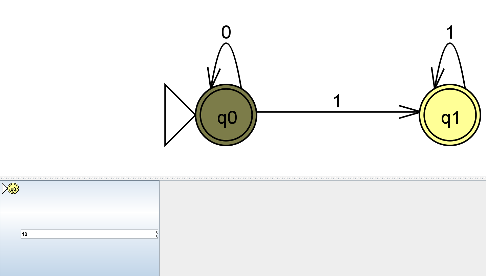
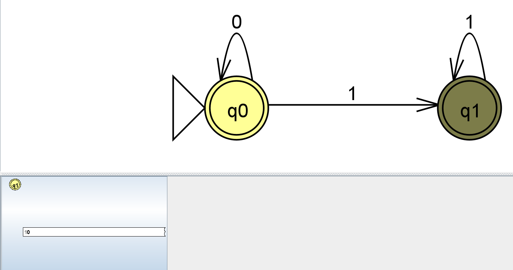
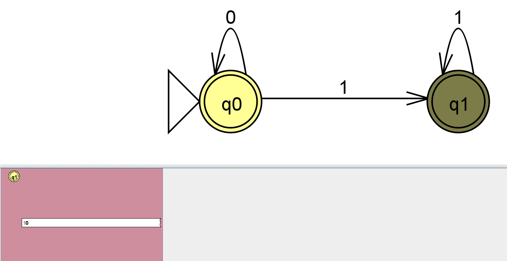

# Exercise n10: Report

**Language:** {string s | s doesn't contains substring '10'}, alphabet {0, 1}

## 1. NFA diagram

## 2. Batch run of the test strings

File: [n10t.txt](n10t.txt). Lines 1-12 are accepted, lines 13-24 are rejected.

## 3. Challenging moments / mistakes

**Mistake:** my first design for {s | s does not contain the substring `10`} accepted
every input, including strings that contain `10`.

**Cause:** I tried to *detect* the forbidden substring by building a path
q0 –1→ q1 –0→ q2 and leaving q2 non-final. But q0 was Final and had loops on both
`0` and `1`, so one branch could always stay in q0 and accept. In an NFA a string is
accepted if **at least one** branch ends in a Final state, so a branch that reaches
q2 does not reject anything; it is just one more branch that does not accept.

**Fix:** instead of detecting the bad pattern, I described the good strings
(all 0's followed by all 1's, i.e. 0\*1\*):
- removed the `1` loop on q0
- deleted q2 and the `0` edge from q1
- added a `1` loop on q1
- kept q0 and q1 Final

A string is now rejected because every branch dies, not because a branch ends in a
non-final state.

### Original (wrong) NFA

### Corrected NFA

### JFLAP step-by-step for `10` on the original (wrong) NFA

| Step | Symbol read | Current states | Screenshot |
|------|-------------|----------------|------------|
| 0 | (start) | q0 |  |
| 1 | `1` | q0, q1 |  |
| 2 | `0` | q0, q2 |  |

The branch in q2 is not accepting, but the branch in q0 is Final, so `10` is
**accepted**. This is wrong.

### JFLAP step-by-step for `10` on the corrected NFA

| Step | Symbol read | Current states | Screenshot |
|------|-------------|----------------|------------|
| 0 | (start) | q0 |  |
| 1 | `1` | q1 |  |
| 2 | `0` | none (q1 has no `0` transition) |  |

Every branch dies on `0`, so `10` is **rejected**. This is correct.
