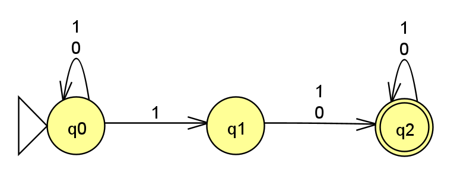
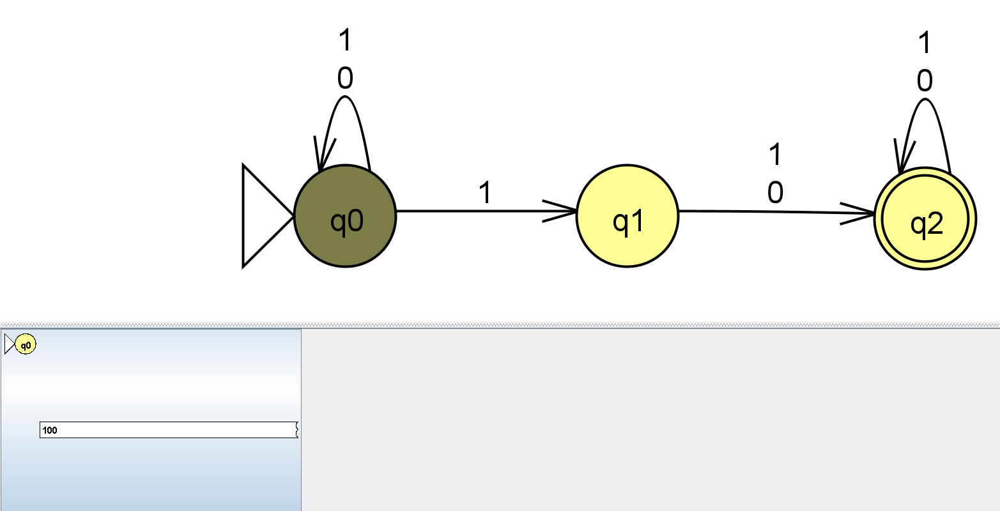
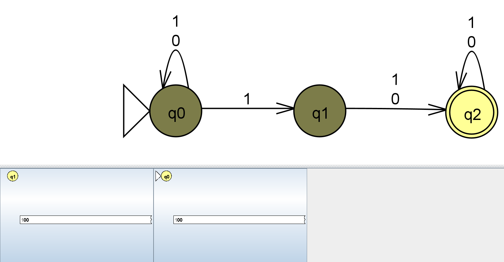
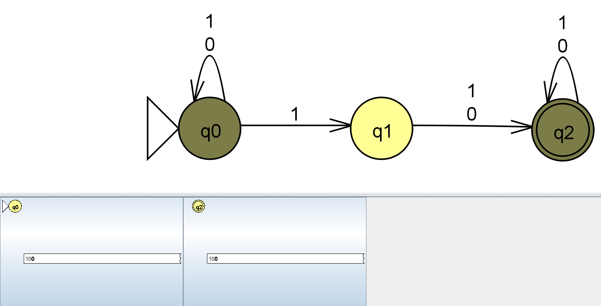
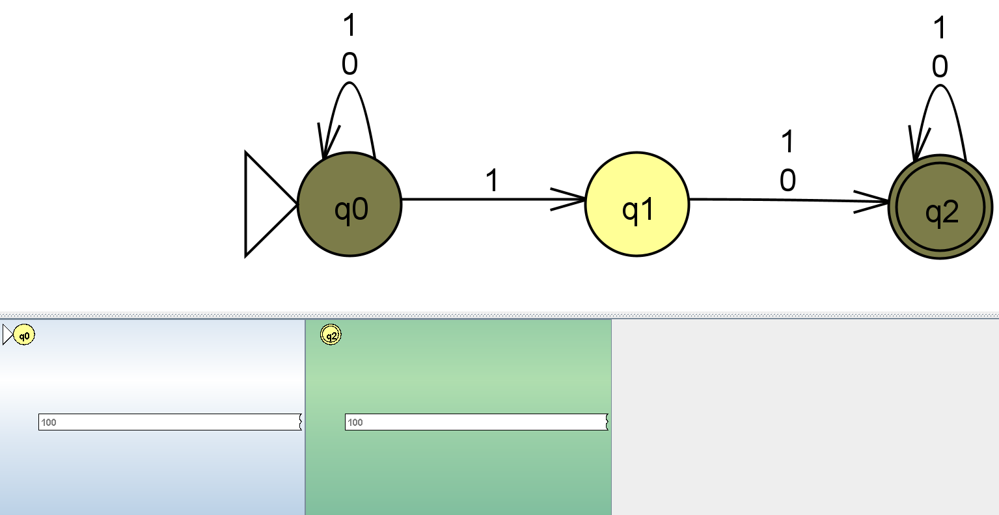
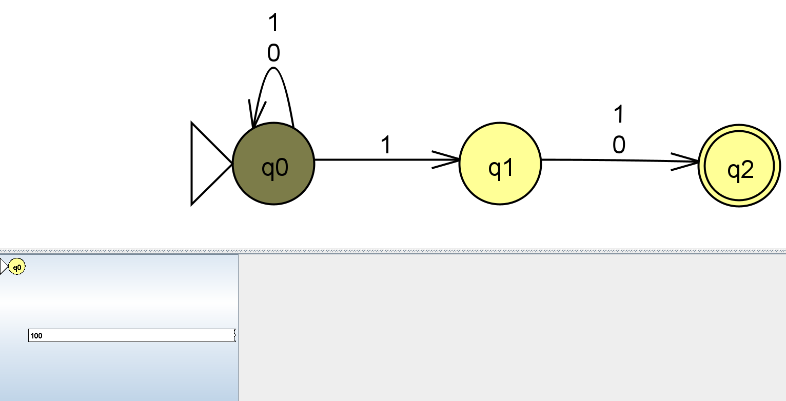
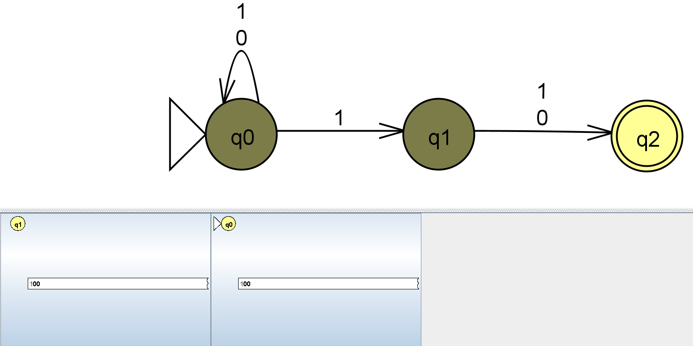
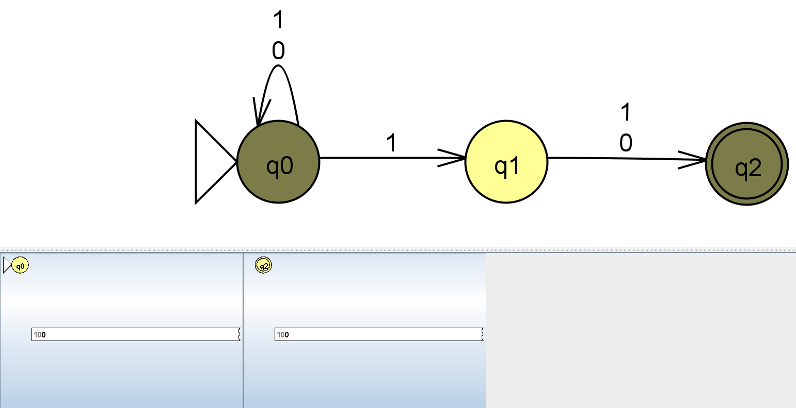
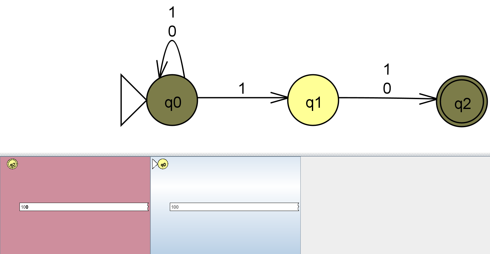

# Exercise n11: Report

**Language:** {string s | the 2nd to last bit is a 1}, alphabet {0, 1}

## 1. NFA diagram

The NFA guesses when the second-to-last bit has arrived:
- **q0 (Initial):** loops on `0` and `1`, reading the beginning of the string.
- **q0 –1→ q1:** the NFA guesses that this `1` is the second-to-last bit.
- **q1 –0,1→ q2:** reads the last bit, whatever it is.
- **q2 (Final):** has no outgoing transitions, so this branch survives only if the input ends right after the last bit.

A string is accepted if at least one branch is in q2 when the input ends. If the guess was wrong (more symbols follow), that branch dies and the other branches continue.

## 2. Batch run of the test strings

File: [n11t.txt](n11t.txt). Lines 1-12 are accepted and lines 13-24 are rejected.

All 24 strings gave the expected result.

## 3. Challenging moments / mistakes

**Wrong variant:** same as the final NFA, but q2 (Final) has a self-loop on `0,1`,
because "anything can follow the second-to-last bit" sounded reasonable.

**What goes wrong:** `100` has a 0 as its second-to-last bit, so it should be
rejected. In the wrong variant it is **accepted**. One branch guesses that the first
`1` is the second-to-last bit, reaches q2, and the loop keeps that branch alive
until the end of the input. An NFA accepts if at least one branch ends in a Final
state, so one surviving branch is enough.

**Fix:** remove the loop on q2. With no outgoing transitions, that branch dies as
soon as another symbol is read.

### Wrong variant

### JFLAP step-by-step for `100` on the wrong variant

| Step | Symbol read | Current states | Screenshot |
|------|-------------|----------------|------------|
| 0 | (start) | q0 |  |
| 1 | `1` | q0, q1 |  |
| 2 | `0` | q0, q2 |  |
| 3 | `0` | q0, q2 |  |

The q2 branch is still alive and Final at the end, so `100` is **accepted**
(incorrect).

### JFLAP step-by-step for `100` on the corrected NFA

| Step | Symbol read | Current states | Screenshot |
|------|-------------|----------------|------------|
| 0 | (start) | q0 |  |
| 1 | `1` | q0, q1 |  |
| 2 | `0` | q0, q2 |  |
| 3 | `0` | q0 |  |

The q2 branch dies on the last `0`, and q0 is not Final, so `100` is **rejected**
(correct).
