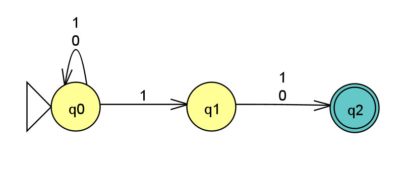
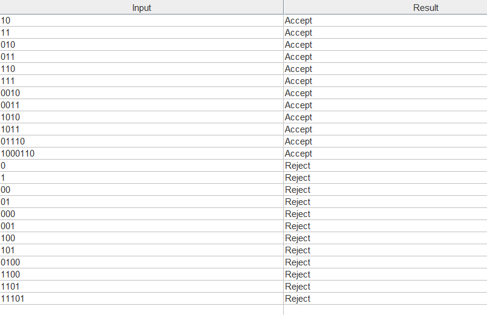

# Exercise n11: Report

**Language:** {string s | the 2nd to last bit is a 1}, alphabet {0, 1}

## 1. NFA diagram

The NFA guesses when the second-to-last bit has arrived:
- **q0 (Initial):** loops on `0` and `1`, reading the beginning of the string.
- **q0 –1→ q1:** the NFA guesses that this `1` is the second-to-last bit.
- **q1 –0,1→ q2:** reads the last bit, whatever it is.
- **q2 (Final):** has no outgoing transitions, so this branch survives only if the input ends right after the last bit.

A string is accepted if at least one branch is in q2 when the input ends. If the guess was wrong (more symbols follow), that branch dies and the other branches continue.

## 2. Batch run of the test strings

File: [n11t.txt](n11t.txt). Lines 1-12 are accepted and lines 13-24 are rejected.

All 24 strings gave the expected result.
