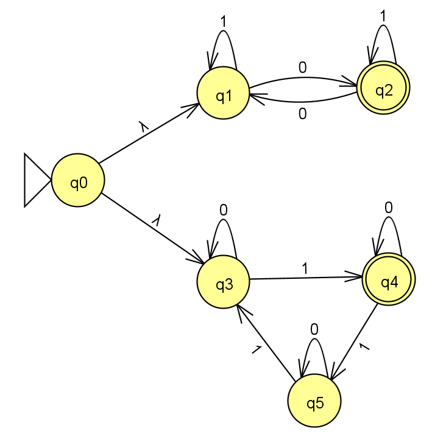
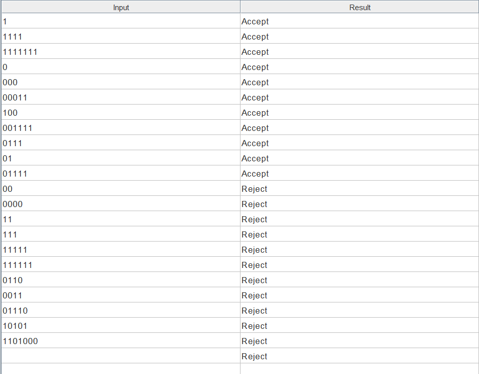

# Exercise n20: Report

**Language:** {s | s has 3k+1 ones (k >= 0) or an odd number of 0's}, alphabet {0, 1}

## 1. NFA diagram

## 2. Batch run of the test strings

File: [n20t.txt](n20t.txt). Lines 1-11 are accepted, lines 12-22 are rejected.

