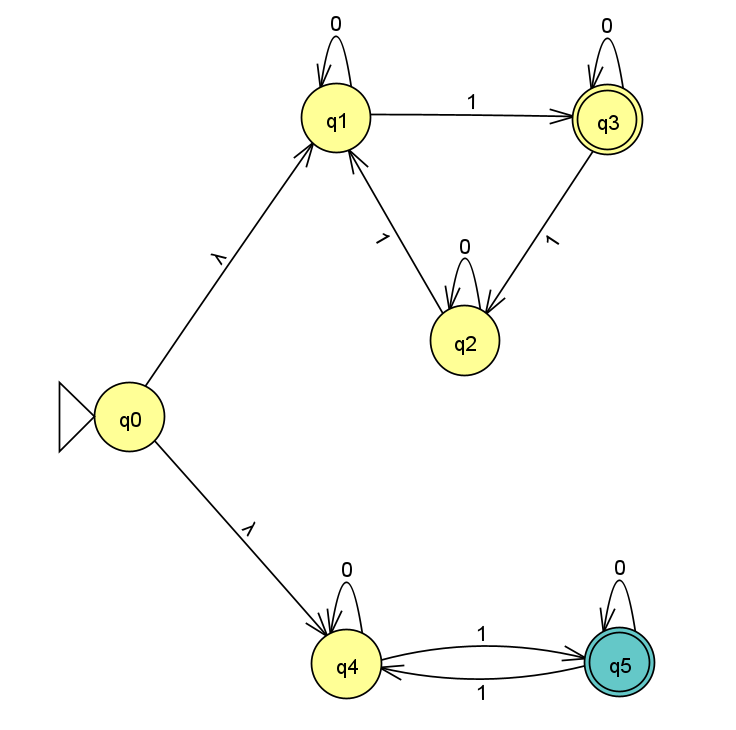
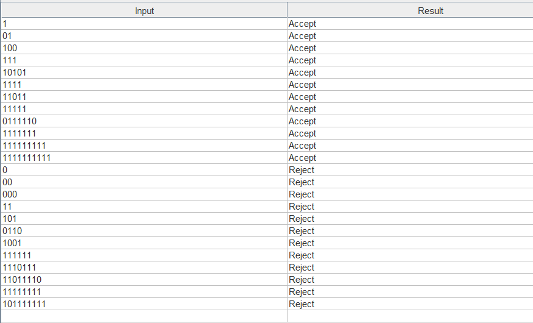

# Exercise n22: Report

**Language:** {string s | s has 3k+1 ones (k >= 0) or an odd number of 1's}, alphabet {0, 1}

## 1. NFA diagram

The start state q0 has two λ-transitions:
- **Top branch (q1, q2, q3):** counts the 1's modulo 3, with a loop on `0` in each state. q2 is Final (3k+1 ones).
- **Bottom branch (q4, q5):** toggles on `1` to track the parity of the 1's, with a loop on `0` in each state. q5 is Final (odd number of 1's).

A string is accepted if either branch ends in its Final state. Only the number of 1's matters, so a string is rejected exactly when that number is ≡ 0 or 2 (mod 6).

## 2. Batch run of the test strings

File: [n22t.txt](n22t.txt). Lines 1-12 are accepted and lines 13-24 are rejected.

All 24 strings gave the expected result.
